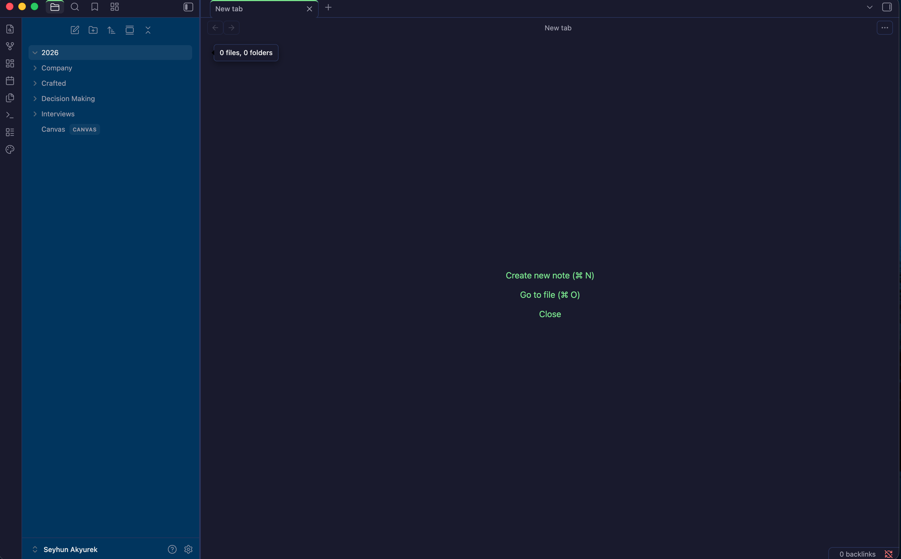

# Crafted Theme for Obsidian

A meticulously dark theme for Obsidian by Crafted (we-crafted.com) that's easy on the eyes and optimized for readability. Built for those who spend hours writing, coding, and thinking.



## Features

- **Dark & Readable**: Deep navy background (#1a1a2e) with soft green accents for comfortable extended use
- **High Contrast**: Carefully tuned text colors that reduce eye strain
- **Modern Design**: Rounded corners, smooth transitions, and polished UI elements
- **Code-Friendly**: Optimized monospace fonts and syntax highlighting
- **Mobile Responsive**: Fully functional on desktop and mobile devices
- **Print Ready**: Clean styling when printing your notes

## Installation

### Community Themes (Recommended)

1. Open Obsidian Settings
2. Go to **Appearance** → **Themes**
3. Click **Manage** and search for "Crafted"
4. Click **Install** and then **Use**

### Manual Installation

1. Download `manifest.json` and `theme.css` from the [latest release](https://github.com/YOUR_USERNAME/Crafted/releases)
2. Create a folder named `Crafted` in your vault's `.obsidian/themes/` directory
3. Copy the downloaded files into the folder
4. Open Obsidian Settings → Appearance → Themes
5. Select "Crafted" from the dropdown

## Color Palette

### Dark Theme

| Color | Hex | Usage |
|-------|-----|-------|
| Primary Background | `#1a1a2e` | Main editor background |
| Secondary Background | `#0f3460` | Sidebar, panels |
| Accent | `#7ee787` | Links, highlights, interactive elements |
| Text | `#eaeaea` | Primary text |
| Muted | `#a0a0b0` | Secondary text, icons |

### Light Theme

| Color | Hex | Usage |
|-------|-----|-------|
| Primary Background | `#fafafa` | Main editor background |
| Secondary Background | `#e8e8ef` | Sidebar, panels |
| Accent | `#48bb78` | Links, highlights, interactive elements |
| Text | `#2d3748` | Primary text |

## Typography

- **Interface**: System UI font stack
- **Editor**: -apple-system, BlinkMacSystemFont, "Segoe UI", Roboto, sans-serif
- **Code**: "JetBrains Mono", "Fira Code", "Cascadia Code", Menlo, monospace

## Customization

You can customize the theme by adding CSS snippets in Obsidian:

1. Open Settings → Appearance → CSS Snippets
2. Click the folder icon to open the snippets folder
3. Create a new `.css` file with your overrides

### Example: Adjust accent color

```css
.theme-dark {
  --interactive-accent: #ff7b72;
  --interactive-accent-hover: #ff9a90;
}
```

## Compatibility

- **Obsidian Version**: 1.0.0+
- **Desktop**: macOS, Windows, Linux
- **Mobile**: iOS, Android

## Changelog

### 1.0.0
- Initial release
- Dark and light theme support
- Full UI component styling
- Mobile responsiveness

## Credits

Created by [Seyhun Akyurek](https://seyhunakyurek.com) by [Crafted](https://we-crafted.com)

## License

MIT License - feel free to use, modify, and distribute!

---